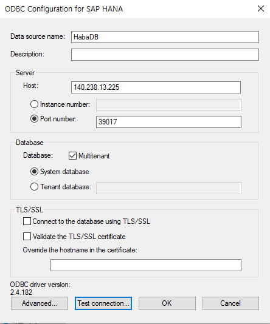

## OAC(Oracle Analytics) Hana Interface 

* [hana jdbc driver](https://developers.sap.com/tutorials/hxe-connect-hxe-using-jdbc.html#ce721b2d-a0a6-4f23-972d-4d7301d5fd7a)
* [https://tools.hana.ondemand.com/#hanatools](https://tools.hana.ondemand.com/#hanatools]
* [Installing SAP HANA HDB Client](https://developers.sap.com/tutorials/hxe-ua-install-hdb-client-windows.html)
* [Connect to SAP HANA, express edition using JDBC](https://developers.sap.com/tutorials/hxe-connect-hxe-using-jdbc.html)
* [Installing SAP HANA, express edition with Docker](https://developers.sap.com/tutorials/hxe-ua-install-using-docker.html)
```bash
ls 
hanaclient-2.4.182-linux-x64.tar.gz
hanaclient-2.4.182-windows-x64.zip
HXEDownloadManager_linux.bin
HXEDownloadManager_linux.exe

cd C:\Users\hiwyl\Downloads\hanaclient-2.4.182-windows-x64
hdbinst.exe
cd C:\Program Files\sap\hdbclient
copy ngdbc.jar C:\Program Files\Oracle Analytics Desktop\war\obi-datasrc-server\WEB-INF\lib
```
## Hana DB Docker install
* oci instance 에 도커엔진 설치
```
 yum install docker-engine
[opc@sap ~]$ sudo systemctl enable docker
Created symlink from /etc/systemd/system/multi-user.target.wants/docker.service to /usr/lib/systemd/system/docker.service.
[opc@sap ~]$ sudo systemctl restart docker
 [opc@sap ~]$ sudo docker login
Login with your Docker ID to push and pull images from Docker Hub. If you don't have a Docker ID, head over to https://hub.docker.com to create one.
Username: hiwylee
Password:
WARNING! Your password will be stored unencrypted in /root/.docker/config.json.
Configure a credential helper to remove this warning. See
https://docs.docker.com/engine/reference/commandline/login/#credentials-store

Login Succeeded

```
* docker test
```
sudo docker run --name helloWorld alpine echo hello
sudo docker image rm alpine -f
``` 
* [Setup instruction](https://hub.docker.com/_/sap-hana-express-edition/plans/f2dc436a-d851-4c22-a2ba-9de07db7a9ac?tab=instructions)
* Edit the host sysctl.conf file
```
vi /etc/sysctl.conf

fs.file-max=20000000
fs.aio-max-nr=262144
vm.memory_failure_early_kill=1
vm.max_map_count=135217728
net.ipv4.ip_local_port_range=40000 60999
```
* Create a directory to persist SAP HANA, express edition data outside of the container
```
sudo mkdir -p /data/mydir
sudo chown 12000:79 /data/mydir
```
* Set up password for SAP HANA, express edition
```
sudo vi /data/mydir/pwd.json
{
"master_password" : "OracleWelcome1"
}

sudo chmod 600 /data/mydir/pwd.json
sudo chown 12000:79 /data/mydir/pwd.json
```

& Load the SAP HANA, express edition container
```
sudo docker run -p 39013:39013 -p 39017:39017 -p 39041-39045:39041-39045 -p 1128-1129:1128-1129 -p 59013-59014:59013-59014 -v /data/express_edition:/hana/mounts \
--ulimit nofile=1048576:1048576 \
--sysctl kernel.shmmax=1073741824 \
--sysctl net.ipv4.ip_local_port_range='40000 60999' \
--sysctl kernel.shmmni=524288 \
--sysctl kernel.shmall=8388608 \
--name express_edition \
store/saplabs/hanaexpress:2.00.045.00.20200121.1 \
--passwords-url file:///hana/mounts/password.json \
--agree-to-sap-license

Unable to find image 'store/saplabs/hanaexpress:2.00.045.00.20200121.1' locally
Trying to pull repository docker.io/store/saplabs/hanaexpress ...
2.00.045.00.20200121.1: Pulling from docker.io/store/saplabs/hanaexpress
69d1da6f4532: Pulling fs layer
c122971cf092: Pulling fs layer
ce2873978954: Pulling fs layer
93f9bed8cf38: Pulling fs layer
68a77c184ed8: Pulling fs layer
c0fd809029af: Pulling fs layer
68a77c184ed8: Waiting
93f9bed8cf38: Waiting
c0fd809029af: Waiting
ce2873978954: Download complete
69d1da6f4532: Verifying Checksum
69d1da6f4532: Download complete
68a77c184ed8: Verifying Checksum
68a77c184ed8: Download complete
93f9bed8cf38: Verifying Checksum
93f9bed8cf38: Download complete
c122971cf092: Verifying Checksum
c122971cf092: Download complete
69d1da6f4532: Pull complete
c122971cf092: Pull complete
ce2873978954: Pull complete
c0fd809029af: Verifying Checksum
c0fd809029af: Download complete
93f9bed8cf38: Pull complete
68a77c184ed8: Pull complete
c0fd809029af: Pull complete
Digest: sha256:57f63719fa71c30aa6e13fdcaebcdd79726bb7702a233ba779b047d98ab1042f
Status: Downloaded newer image for store/saplabs/hanaexpress:2.00.045.00.20200121.1
```
```
sudo docker container restart express_edition

```
* login sap hana db docker
```
[opc@sap ~]$  sudo docker exec -it express_edition  bash
hxeadm@c82c8fda3f30:/usr/sap/HXE/HDB90>
hxeadm@c82c8fda3f30:/usr/sap/HXE/HDB90>
hxeadm@c82c8fda3f30:/usr/sap/HXE/HDB90> ls
HDB  HDBAdmin.sh  HDBSettings.csh  HDBSettings.sh  c82c8fda3f30  exe  hdbenv.csh  hdbenv.sh  work  xterms
hxeadm@c82c8fda3f30:/usr/sap/HXE/HDB90> whoami
hxeadm
hxeadm@c82c8fda3f30:/usr/sap/HXE/HDB90> ls
HDB  HDBAdmin.sh  HDBSettings.csh  HDBSettings.sh  c82c8fda3f30  exe  hdbenv.csh  hdbenv.sh  work  xterms
hxeadm@c82c8fda3f30:/usr/sap/HXE/HDB90>

```
* Optional: Test the Container
```
hxeadm@c82c8fda3f30:/usr/sap/HXE/HDB90> HDB info
USER          PID     PPID  %CPU        VSZ        RSS COMMAND
hxeadm       1499        0   0.0      21060       4096 bash
hxeadm       2423     1499  12.5      20256       3328  \_ /bin/sh /usr/sap/HXE/HDB90/HDB info
hxeadm       2454     2423   0.0      43532       3420      \_ ps fx -U hxeadm -o user:8,pid:8,ppid:8,pcpu:5,vsz:10,rss:10,args
hxeadm          1        0   0.0      21036       4012 /bin/bash /run_hana --passwords-url file:///hana/mounts/pwd.json --agree-to-sap-license
hxeadm        852        1   0.1     359840      52996 hdbdaemon
hxeadm        858      852   119    3943432    2700376  \_ hdbnameserver
hxeadm       1256      852   0.7     429688     123668  \_ hdbcompileserver
hxeadm       1259      852   0.9     823352     153796  \_ hdbpreprocessor
hxeadm       1302      852   2.6    1673168     556132  \_ hdbwebdispatcher
hxeadm       1443      852  95.4    3321416    2293796  \_ hdbindexserver -port 39040
hxeadm        993        1   0.0     611832      47752 hdbrsutil  --start --port 39001 --volume 1 --volumesuffix mnt00001/hdb00001 --identifier 1586247032
hxeadm       1579        1   0.0     611832      47696 hdbrsutil  --start --port 39040 --volume 2 --volumesuffix mnt00001/hdb00002.00003 --identifier 1586247115

```
* Optional: Log into the database
```
hxeadm@c82c8fda3f30:/usr/sap/HXE/HDB90> hdbsql -i 90 -d SYSTEMDB  -u SYSTEM -p OracleWelcome1

Welcome to the SAP HANA Database interactive terminal.

Type:  \h for help with commands
       \q to quit

hdbsql SYSTEMDB=>

```
* Simple QUery
```
SELECT * FROM objects WHERE object_name LIKE '%TABLE%' AND schema_name = 'PUBLIC'

```
* JDBC 
```
jdbc:sap://<ip_address>:39017/?databaseName=<database_name>

```
## Connection 
* system database via JDBC : Port 39017
```
C:\Program Files\sap\hdbclient>java -jar ngdbc.jar -u system,OracleWelcome1 -n 140.238.13.225:39017 -c "SELECT DATABASE_NAME FROM SYS.M_DATABASES" -d systemdb
Connected.
| DATABASE_NAME                                                                                        |
--------------------------------------------------------------------------------------------------------
| SYSTEMDB                                                                                             |
| HXE                                                                                                  |
2 rows.
```
*  tenant database via JDBC, : port 39041

```
jdbc:sap://<ip_address>:39041/?databaseName=<tenant_name>
com.sap.db.jdbc.Driver
```
* [https://help.sap.com/viewer/e9146b36040844d0b1f309bc8c1ba6ab/3.0/en-US/734759c0c1c9440c857da0d366e47dda.html](https://help.sap.com/viewer/e9146b36040844d0b1f309bc8c1ba6ab/3.0/en-US/1d174ab283fe496a902063e107520b8a.html)
* [docker 명령어 참조](https://datascienceschool.net/view-notebook/708e711429a646818b9dcbb581e0c10a/)
  
```

```

```
