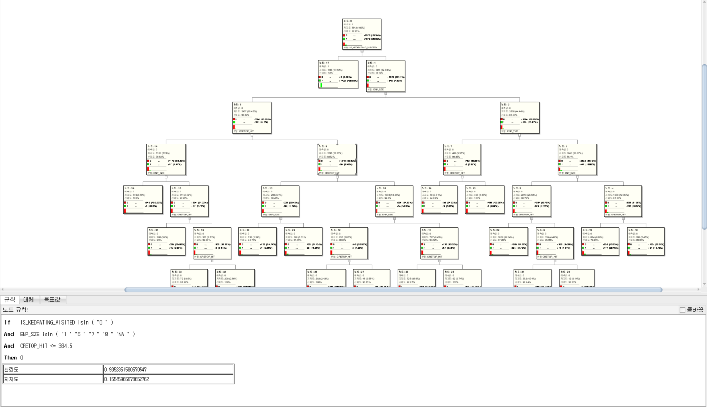
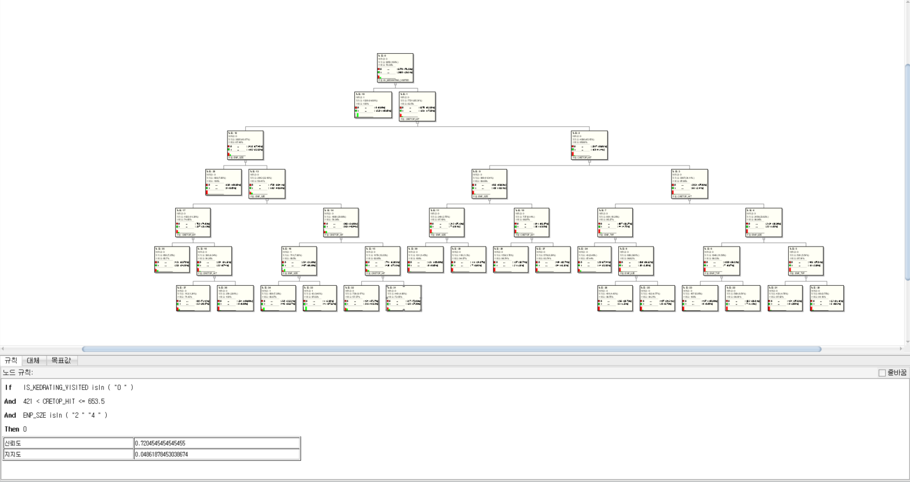
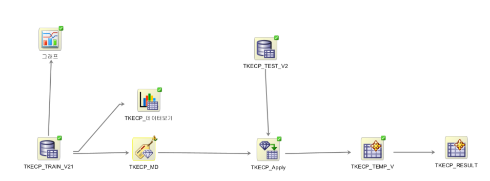
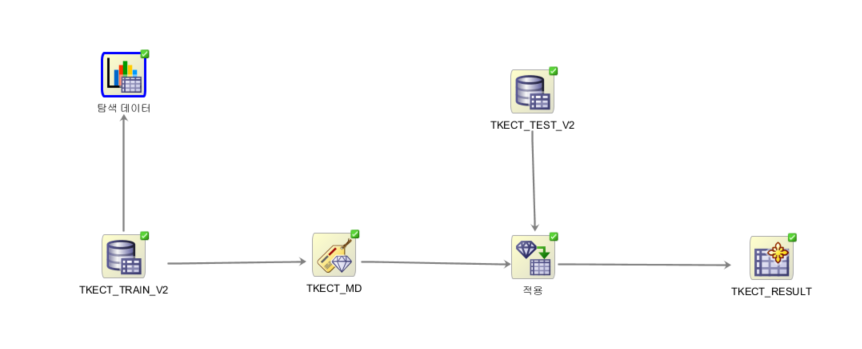

## To Do
### KED PoC 내용
* 데이터 정합성 확인
* ADW (OLM4SQL) or OAS DB : Attribute Impotance (Feature Selection )
* OAC : 머신러닝 모델  : 조회 서비스 가입자-> 평가 서비스 가입 가능성 모델
* OAC : 모델 시각화 
* OAC : 모델적용 - 평가 서비스 가입 대상 고객 추출  (KEDCD)
* OAC : 평가 서비스 가입 대상 정보 시각화 
* 기타 확인 사항

#### 0. 유의미한 목표 변수
* ENP_TYP
* KSIC10_BZC_CD  <=  첫문자만
* ENP_SZE
* LOC_ZIP
* CRETOP_HIT

#### 1. 데이터 정합성 확인
* ML 데이터
  * DIFF_MM / PD_CD  값이 0 유무에 따라 IS_TRANSITED 이 결정됨.
     *   
     * IS_TRANSITED : DIFF_MM = 0 이면 IS_TRANSITED = 0 / DIFF_MM != 0 이면 IS_TRANSITED = 1
  * Feature 로 사용못하는 컬럼.(NA 가 너무 많음)
     * 
<!--
  * N/A 값 존재 컬럼
    * ENP_TYP :  법인(1), 개인(2)  => N/A 있음.
    * ENP_SZE :  N/A 있음. => 판단제외(08)
    * DIFF_MM : N/A 있음. => 0
    * CRETOP_HIT : N/A 있음. => 0
    * 이하 숫치 데이터에 NA
-->
   * Feature로 사용된 컬럼
     * 
 * ``식별자&구분자 중복값 있음`` : KEDCD     ,BZNO     ,RPT_CCD     ,CU_ID     ,PR_POLC_CD    ,PD_CD

* 기업 기본 데이터
* 재무 데이터 (추후 요청 예정)
#### 2. ADW(OLM4SQL) or OAS DB : Attribute Impotance (Feature Selection )
* Oracle Data Miner 를 활용해야 하므로 OAS DB 사용 예정
#### 3. OAC      : 머신러닝 모델  : 조회 서비스 가입자-> 평가 서비스 가입 가능성 모델
* CRETOP→KCR (고객이 R로 수행)
* CRETOP→PCR
  *  
* CRETOP→TCB
  * *  
#### 4. OAC      : 모델 시각화 
* CRETOP→KCR (고객이 R로 수행)
* CRETOP→PCR
  *  
* CRETOP→TCB 
  *  
#### 5.OAC      : 모델적용 - 평가 서비스 가입 대상 고객 추출  (KEDCD)
* Input Data : <b>``테스트 데이터에서 평가 서비스에 가입하지 않은 고객을 대상으로 적용``</b>
* CRETOP→KCR (고객이 R로 수행)
* CRETOP→PCR
* CRETOP→TCB  
#### 6. OAC : 평가 서비스 가입 대상 정보 시각화 
* 담당 : 오리진 
* 가입대상 기업 재무 정보 요청 (KEDCD)
* 대상 기업 시각화 : 소희 부장이 이전에 만든 것 참조하여 오리진에 요청
#### 7. 기타 확인 사항
* 클라우드 SE Trials 신규 요청
* 데이터 이관
* 오라진 클라우드 계정 생성
* 오리진 데이터 / 시각화 범위 설명
---
## 확인 필요사항 
#### 데이터 정합성 
* ``OAC  Data Flow 에서 ML 만든 ML->Inspec -> 시각화 시 데이터 에러 발생``
* ML용 데이터 


### 트리 시각화 차트 Plugin  : `` OAC ML 을 시각화 시키지 못할 경우 사용할 수 없음``
* [Oracle Analytics Library](https://www.oracle.com/kr/business-analytics/data-visualization/extensions.html)
  * [Collapsible Tree plugin](https://blogs.oracle.com/analytics/drive-deeper-insight-with-an-oracle-data-visualization-plugin)
  * [Org-Chart Custom Viz Plugin](https://www.youtube.com/watch?v=vXuM3viOL4g&feature=youtu.be)
  * [Elbow Dendrogram]
  * [Value-Based Converter Plugin](https://www.youtube.com/watch?v=lZUWEbRJapY&feature=youtu.be)

## 데이터
* ML용 데이터 Data 정합성
* ML 용  Train/Test 데이터 : TKECP_*/TKECT_* / TKECK_*
```sql
SELECT COUNT(*) CNT 
FROM (
  SELECT distinct 
     KEDCD
    ,BZNO
    ,RPT_CCD
    ,CU_ID
    ,PR_POLC_CD
    ,PD_CD
  FROM   tkecp_TRAIN);        

      CNT
----------
      8088

  
SELECT COUNT(*) 
FROM   tkecp_TRAIN;    

  COUNT(*)
----------
     13887

```     
* ``CASE ID`` :  ``ROWID``

```sql
DROP VIEW TKECP_TRAIN_V2;
CREATE OR REPLACE   VIEW "DMUSER"."TKECP_TRAIN_V2"  AS
    SELECT 
       ROWIDTOCHAR (ROWID)  AS CASE_ID,
        "KEDCD",
        "BZNO",
        "RPT_CCD",
        "CU_ID",
        "PR_POLC_CD",
        "PD_CD",        
        "IS_TRANSITED",
        "IS_KEDRATING_VISITED",
        "ENP_TYP",
        "KSIC10_BZC_CD",
        "ENP_SZE",
        "LOC_ZIP",
--        DECODE ("DIFF_MM",'NA',0,to_number("DIFF_MM")) AS "DIFF_MM",
--        DECODE ("CRETOP_HIT",'NA',0,to_number("CRETOP_HIT")) AS "CRETOP_HIT",
        "DIFF_MM",
        "CRETOP_HIT",
/*	
        "TXPL_UNI_CN_IN",
        "TXPL_TCN_IN",
        "TXPL_DTCN_IN",
        "TXPL_RATIO_IN",
        "TXPL_AM_IN",
        "TXPL_AVG_IN",
        "TXPL_SD_IN",
        "TXPL_CV_IN",
        "TXPL_HHI_IN",
        "RPT_TCN_IN",
        "TXPL_UNI_CN_OUT",
        "TXPL_TCN_OUT",
        "TXPL_DTCN_OUT",
        "TXPL_RATIO_OUT",
        "TXPL_AM_OUT",
        "TXPL_AVG_OUT",
        "TXPL_SD_OUT",
        "TXPL_CV_OUT",
        "TXPL_HHI_OUT",
        "RPT_TCN_OUT",
        "EWGRD_AVG_IN",
        "EWGRD_SD_IN",
        "EWGRD_CV_IN",
        "EWGRD_MIN_IN",
        "EWGRD_MAX_IN",
        "EWGRD_AVG_OUT",
        "EWGRD_SD_OUT",
        "EWGRD_CV_OUT",
        "EWGRD_MIN_OUT",
        "EWGRD_MAX_OUT",
        "CRETOP_CN_IN",
        "CRETOP_CN_OUT",
        "START_DT_CRETOP",
        "POINT_DT_CRETOP",
        "POINT_DT_REPORT",
*/	
        "POINT_DT_KEDRATING"
    FROM
        tkecp_train;

DROP VIEW TKECP_TEST_V2;
CREATE OR REPLACE   VIEW "DMUSER"."TKECP_TEST_V2"  AS
    SELECT 
        ROWIDTOCHAR (ROWID)  AS CASE_ID,
        "KEDCD",
        "BZNO",
        "RPT_CCD",
        "CU_ID",
        "PR_POLC_CD",
        "PD_CD",
        "IS_TRANSITED",
        "IS_KEDRATING_VISITED",
        "ENP_TYP",
        "KSIC10_BZC_CD",
        "ENP_SZE",
        "LOC_ZIP",
--        DECODE ("DIFF_MM",'NA',0,to_number("DIFF_MM")) AS "DIFF_MM",
--        DECODE ("CRETOP_HIT",'NA',0,to_number("CRETOP_HIT")) AS "CRETOP_HIT",
        "DIFF_MM",
        "CRETOP_HIT",
/*	
        "TXPL_UNI_CN_IN",
        "TXPL_TCN_IN",
        "TXPL_DTCN_IN",
        "TXPL_RATIO_IN",
        "TXPL_AM_IN",
        "TXPL_AVG_IN",
        "TXPL_SD_IN",
        "TXPL_CV_IN",
        "TXPL_HHI_IN",
        "RPT_TCN_IN",
        "TXPL_UNI_CN_OUT",
        "TXPL_TCN_OUT",
        "TXPL_DTCN_OUT",
        "TXPL_RATIO_OUT",
        "TXPL_AM_OUT",
        "TXPL_AVG_OUT",
        "TXPL_SD_OUT",
        "TXPL_CV_OUT",
        "TXPL_HHI_OUT",
        "RPT_TCN_OUT",
        "EWGRD_AVG_IN",
        "EWGRD_SD_IN",
        "EWGRD_CV_IN",
        "EWGRD_MIN_IN",
        "EWGRD_MAX_IN",
        "EWGRD_AVG_OUT",
        "EWGRD_SD_OUT",
        "EWGRD_CV_OUT",
        "EWGRD_MIN_OUT",
        "EWGRD_MAX_OUT",
        "CRETOP_CN_IN",
        "CRETOP_CN_OUT",
        "START_DT_CRETOP",
        "POINT_DT_CRETOP",
        "POINT_DT_REPORT",
*/	
        "POINT_DT_KEDRATING"
    FROM
        tkecp_test;
```

## Data Loading 스크립트
* cloud shell
```bash
1. cloud shell
wonyong_le@cloudshell:ked (ap-seoul-1)$ wonyong_le@cloudshell:~ (ap-seoul-1)$ oci os object list  -bn data --output table
+------+----------------------------+----------------------------------------+------------+----------------------------------+---------------+
| etag | md5                        | name                                   | size       | time-created                     | time-modified |
+------+----------------------------+----------------------------------------+------------+----------------------------------+---------------+
| None | N69vrCuerEkfFyXcYly7Uw==-8 | 20200619_Z_KEDYMJ_TKE001_INTR_UTF2.txt | 1048207657 | 2020-06-30T07:49:29.814000+00:00 | None          |
| None | oldwT2cVWzuyhZrPTJMp6w==   | Wallet_keddb.zip                       | 20530      | 2020-06-30T07:49:48.118000+00:00 | None          |
+------+----------------------------+----------------------------------------+------------+----------------------------------+---------------+
wonyong_le@cloudshell:ked (ap-seoul-1)$ oci os object get --name Wallet_keddb.zip  -bn data --file Wallet_keddb.zip
Downloading object  [####################################]  100%
wonyong_le@cloudshell:ked (ap-seoul-1)$ 
wonyong_le@cloudshell:ked (ap-seoul-1)$ 
wonyong_le@cloudshell:ked (ap-seoul-1)$ pwd
/home/wonyong_le/ked
wonyong_le@cloudshell:ked (ap-seoul-1)$ cd wallet/
wonyong_le@cloudshell:wallet (ap-seoul-1)$ ls
wonyong_le@cloudshell:wallet (ap-seoul-1)$ unzip ../Wallet_keddb.zip 
Archive:  ../Wallet_keddb.zip
  inflating: README                  
  inflating: cwallet.sso             
  inflating: tnsnames.ora            
  inflating: truststore.jks          
  inflating: ojdbc.properties        
  inflating: sqlnet.ora              
  inflating: ewallet.p12             
  inflating: keystore.jks            
wonyong_le@cloudshell:wallet (ap-seoul-1)$ vi sqlnet.ora 
wonyong_le@cloudshell:wallet (ap-seoul-1)$ head -n 1 sqlnet.ora
WALLET_LOCATION = (SOURCE = (METHOD = file) (METHOD_DATA = (DIRECTORY="$TNS_ADMIN")))
wonyong_le@cloudshell:wallet (ap-seoul-1)$ 
 
wonyong_le@cloudshell:wallet (ap-seoul-1)$ export TNS_ADMIN=/home/wonyong_le/ked/wallet
wonyong_le@cloudshell:wallet (ap-seoul-1)$ tail -n 1 ~/.bashrc
export TNS_ADMIN=/home/wonyong_le/ked/wallet
wonyong_le@cloudshell:wallet (ap-seoul-1)$ 
wonyong_le@cloudshell:wallet (ap-seoul-1)$ sqlplus admin/OracleWelcome1@keddb_high

SQL*Plus: Release 19.0.0.0.0 - Production on Tue Jun 30 08:15:11 2020
Version 19.5.0.0.0

Copyright (c) 1982, 2019, Oracle.  All rights reserved.

Last Successful login time: Tue Jun 30 2020 08:13:30 +00:00

Connected to:
Oracle Database 19c Enterprise Edition Release 19.0.0.0.0 - Production
Version 19.5.0.0.0

```
* sqldeveloper
```sql
DBMS_CLOUD.DROP_CREDENTIAL(credential_name => 'POC_CRED');
begin
    DBMS_CLOUD.CREATE_CREDENTIAL(
        credential_name => 'POC_CRED',
        username        => 'oracleidentitycloudservice/wonyong.lee@oracle.com',
        password        => '<ST.WS2_TkT4{1J[BOH]'
  );
end;

DROP TABLE TKE001;
SQLLDR 사용시 아래와 같이 ch 
CREATE TABLE TKE001 (
	KEDCD VARCHAR2(10 char),       --  NOT NULL,                     
	ENP_NM VARCHAR2(200 char),     --  NOT NULL, 100->200
	ENP_NM_TRD VARCHAR2(200 char),  -- 100->200
	ENP_NM_ENG VARCHAR2(200 char),
	ENP_TYP VARCHAR2(10 char),     --- 1 ==> 10 
	ENP_SZE VARCHAR2(2 char),
	GRDT_PLN_DT VARCHAR2(10 char),   --- 
	ENP_FCD VARCHAR2(2 char),
	ESTB_FCD VARCHAR2(2 char),
	REL_KEDCD VARCHAR2(10 char),
	REL_ESTB_DT VARCHAR2(8 char),
	ENP_SCD VARCHAR2(2 char),
	ENP_SCD_CHG_DT VARCHAR2(8 char),
	PUBI_FCD VARCHAR2(10 char),    --- 
	VENP_YN VARCHAR2(2 char),      -- 
	ENP_FORM_FR VARCHAR2(1 char),
	BZC_CD VARCHAR2(6 char),
	FS_BZC_CD VARCHAR2(2 char),
	GRP_CD VARCHAR2(4 char),
	GRP_NM VARCHAR2(50 char),
	CONO_PID VARCHAR2(13 char),
	ESTB_DT VARCHAR2(8 char),
	IPO_CD VARCHAR2(1 ),
	TRDBZ_RPT_NO VARCHAR2(10 char),
	LIST_DT VARCHAR2(8 char),
	DLIST_DT VARCHAR2(8 char),
	MTX_BNK_CD VARCHAR2(7 char),
	OVD_TX_BNK_CD VARCHAR2(7 char),
	ACCT_EDDT VARCHAR2(4 char),
	WK_UNN_YN VARCHAR2(1 char),
	WK_UNN_ORG_DT VARCHAR2(8 char),
	HPAGE_URL VARCHAR2(200 char),  -- 50-> 200
	EMAIL VARCHAR2(40 char),
	STD_DT VARCHAR2(8) NOT NULL,
	UPD_DT VARCHAR2(8)   NOT NULL,
	CEMNO VARCHAR2(80)   NOT NULL,   -- 6 -> 80
	LT_BZ_RST_DT VARCHAR2(8 char),
	KSIC9_BZC_CD VARCHAR2(6 char),
	KSIC10_BZC_CD VARCHAR2(6 char),
	TECH_GRP_CD VARCHAR2(2 char),
	KIFRS_APL_YN VARCHAR2(1 char),
	KIFRS_APL_DT VARCHAR2(8 char),
	MSENP_RNG_CD VARCHAR2(2 char),
	VAT_AD_BASE_CCD VARCHAR2(2 char),
	ENP_SZE_JUG_RSN_CD VARCHAR2(2 char),
	JUG_RSN_DTL_CTT VARCHAR2(100 char),
	MSENP_CONFD_VT_DT VARCHAR2(8)  
);

-- quote removed txt
begin 
    dbms_cloud.copy_data(
        table_name => 'TKE001',
        credential_name => 'POC_CRED',
        file_uri_list => 'https://objectstorage.ap-seoul-1.oraclecloud.com/n/cn5clq2cmd0d/b/data/o/20200619_Z_KEDYMJ_TKE001_INTR_UTF2.txt',
        schema_name => 'ADMIN',
        format => json_object(
            'delimiter' value '|'
            ,'recorddelimiter' value '''\n'''
         --   ,'quote' value '\"', 
         --   ,'quote' value '"' 
            ,'rejectlimit' value '1000'
         --   ,'rejectlimit' value '0'
            ,'trimspaces' value 'rtrim'
            ,'ignoreblanklines' value 'false'
            ,'ignoremissingcolumns' value 'true'
            ,'dateformat' value 'YYYYMMDD'
            --, 'removequotes' value 'true'
            )
        ); 
end; 
/

select count(*) from tke001;
set pagesize 1000
select * from copy$8_log;
select * from copy$8_bad;

ORA-12899: value too large for column ENP_TYP (actual: 10, maximum: 1)
ORA-12899: value too large for column ENP_TYP (actual: 10, maximum: 1)
ORA-12899: value too large for column ENP_TYP (actual: 6, maximum: 1)
ORA-12899: value too large for column ENP_TYP (actual: 5, maximum: 1)


661개 행이 선택되었습니다. 


RECORD                                                                          
--------------------------------------------------------------------------------
0002476285|베이비유(상림)|베이비유(상림) ||BABY U CO.|2|06||16|01|||01||00|N||L70119|01|||55
9010520206|힐탑||하우스|힐탑||하우스||2|03||16|01|||04|20160215|00|N|||01|||||6|||||||||||
0001001451|아.레이|아.레이|A|L CO.|2|03||16|01|||01|20110604|00|N||G52416|01|||6001132
0001939469|윈클로|윈클로 ||Winklo CO.|2|06||16|01|||01||00|N||D26329|01|||760712151931

  COUNT(*)
----------
   6412183
   
```

### Data Miner Temp (ODMR$...)  Table Drop
* Procedure
```sql
set SERVEROUTPUT ON
CREATE OR REPLACE TYPE DROP_STATEMENTS IS TABLE OF VARCHAR2(228);
DECLARE
  v_sql VARCHAR2(128);
  v_tables DROP_STATEMENTS;
BEGIN
  v_sql := 'select ''drop table '' || table_name from user_tables where table_name like ''ODMR$%'' ';
  EXECUTE IMMEDIATE v_sql BULK COLLECT INTO v_tables;
  FOR j in 1..v_tables.COUNT LOOP
  DBMS_OUTPUT.PUT_LINE( v_tables(j) );
    execute immediate v_tables(j);
  END LOOP;
END;
```
