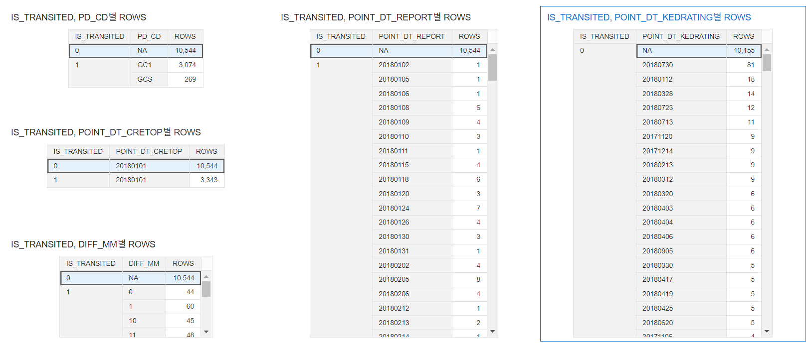
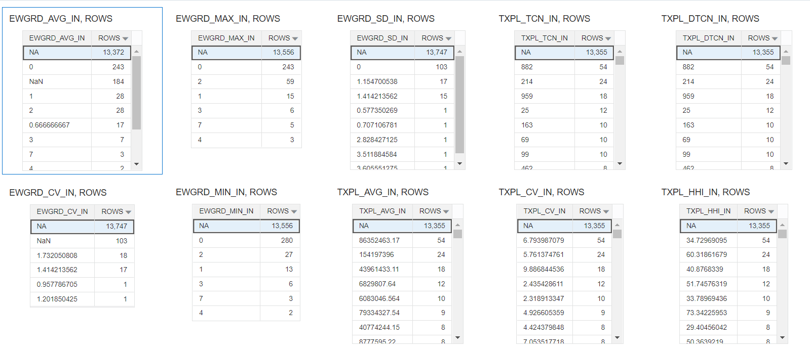
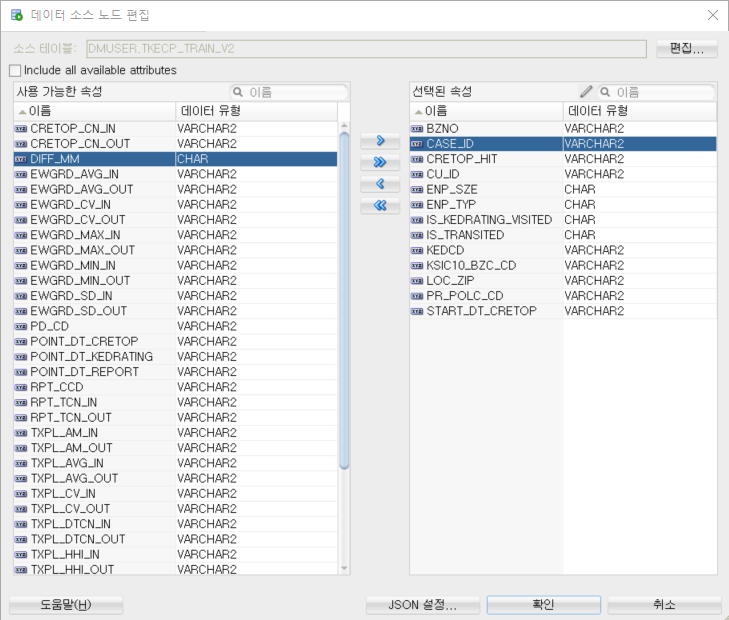

## To Do
<!--
접속 URL :http://140.238.0.234:9502/dv
http://140.238.0.234:9502/analytics
아이디 : wonyoung, haje ==> OdpCA123
140.238.17.22:1521/pdb1.sub12180113580.svcn.oraclevcn.com
6:38 PM
dmuser/WelCome1234#_
-->

#### 1. 데이터 정합성 확인
* ML 데이터
  * DIFF_MM / PD_CD  값이 0 유무에 따라 IS_TRANSITED 이 결정됨.
     *   
     * IS_TRANSITED : DIFF_MM = 0 이면 IS_TRANSITED = 0 / DIFF_MM != 0 이면 IS_TRANSITED = 1
  * Feature 로 사용못하는 컬럼.(NA 가 너무 많음)
     * 
<!--
  * N/A 값 존재 컬럼
    * ENP_TYP :  법인(1), 개인(2)  => N/A 있음.
    * ENP_SZE :  N/A 있음. => 판단제외(08)
    * DIFF_MM : N/A 있음. => 0
    * CRETOP_HIT : N/A 있음. => 0
    * 이하 숫치 데이터에 NA
-->
   * Feature로 사용된 컬럼
     * 
 * ``식별자&구분자 중복값 있음`` : KEDCD     ,BZNO     ,RPT_CCD     ,CU_ID     ,PR_POLC_CD    ,PD_CD
```sql
SELECT COUNT(*) CNT 
FROM (
  SELECT distinct 
     KEDCD
    ,BZNO
    ,RPT_CCD
    ,CU_ID
    ,PR_POLC_CD
    ,PD_CD
  FROM   tkecp_TRAIN);        

      CNT
----------
      8088

  
SELECT COUNT(*) 
FROM   tkecp_TRAIN;    

  COUNT(*)
----------
     13887

```     
* ``CASE ID`` :  ``ROWID``
```sql
DROP VIEW TKECP_TRAIN_V2;
CREATE OR REPLACE   VIEW "DMUSER"."TKECP_TRAIN_V2"  AS
    SELECT 
       ROWID  AS CASE_ID,
        "KEDCD",
        "BZNO",
        "RPT_CCD",
        "CU_ID",
        "PR_POLC_CD",
        "PD_CD",        
        "IS_TRANSITED",
        "IS_KEDRATING_VISITED",
        "ENP_TYP",
        "KSIC10_BZC_CD",
        "ENP_SZE",
        "LOC_ZIP",
--        DECODE ("DIFF_MM",'NA',0,to_number("DIFF_MM")) AS "DIFF_MM",
--        DECODE ("CRETOP_HIT",'NA',0,to_number("CRETOP_HIT")) AS "CRETOP_HIT",
        "DIFF_MM",
        "CRETOP_HIT",
        "TXPL_UNI_CN_IN",
        "TXPL_TCN_IN",
        "TXPL_DTCN_IN",
        "TXPL_RATIO_IN",
        "TXPL_AM_IN",
        "TXPL_AVG_IN",
        "TXPL_SD_IN",
        "TXPL_CV_IN",
        "TXPL_HHI_IN",
        "RPT_TCN_IN",
        "TXPL_UNI_CN_OUT",
        "TXPL_TCN_OUT",
        "TXPL_DTCN_OUT",
        "TXPL_RATIO_OUT",
        "TXPL_AM_OUT",
        "TXPL_AVG_OUT",
        "TXPL_SD_OUT",
        "TXPL_CV_OUT",
        "TXPL_HHI_OUT",
        "RPT_TCN_OUT",
        "EWGRD_AVG_IN",
        "EWGRD_SD_IN",
        "EWGRD_CV_IN",
        "EWGRD_MIN_IN",
        "EWGRD_MAX_IN",
        "EWGRD_AVG_OUT",
        "EWGRD_SD_OUT",
        "EWGRD_CV_OUT",
        "EWGRD_MIN_OUT",
        "EWGRD_MAX_OUT",
        "CRETOP_CN_IN",
        "CRETOP_CN_OUT",
        "START_DT_CRETOP",
        "POINT_DT_CRETOP",
        "POINT_DT_REPORT",
        "POINT_DT_KEDRATING"
    FROM
        tkecp_train;
 /*
       DECODE ("DIFF_MM",'NA',0,to_number("DIFF_MM") AS DIFF_MM,
       DECODE ("CRETOP_HIT",'NA',0,to_number("CRETOP_HIT") AS CRETOP_HIT,
*/
DROP VIEW TKECP_TEST_V2;
CREATE OR REPLACE   VIEW "DMUSER"."TKECP_TEST_V2"  AS
    SELECT 
        ROWID AS CASE_ID,
        "KEDCD",
        "BZNO",
        "RPT_CCD",
        "CU_ID",
        "PR_POLC_CD",
        "PD_CD",
        "IS_TRANSITED",
        "IS_KEDRATING_VISITED",
        "ENP_TYP",
        "KSIC10_BZC_CD",
        "ENP_SZE",
        "LOC_ZIP",
--        DECODE ("DIFF_MM",'NA',0,to_number("DIFF_MM")) AS "DIFF_MM",
--        DECODE ("CRETOP_HIT",'NA',0,to_number("CRETOP_HIT")) AS "CRETOP_HIT",
        "DIFF_MM",
        "CRETOP_HIT",
        "TXPL_UNI_CN_IN",
        "TXPL_TCN_IN",
        "TXPL_DTCN_IN",
        "TXPL_RATIO_IN",
        "TXPL_AM_IN",
        "TXPL_AVG_IN",
        "TXPL_SD_IN",
        "TXPL_CV_IN",
        "TXPL_HHI_IN",
        "RPT_TCN_IN",
        "TXPL_UNI_CN_OUT",
        "TXPL_TCN_OUT",
        "TXPL_DTCN_OUT",
        "TXPL_RATIO_OUT",
        "TXPL_AM_OUT",
        "TXPL_AVG_OUT",
        "TXPL_SD_OUT",
        "TXPL_CV_OUT",
        "TXPL_HHI_OUT",
        "RPT_TCN_OUT",
        "EWGRD_AVG_IN",
        "EWGRD_SD_IN",
        "EWGRD_CV_IN",
        "EWGRD_MIN_IN",
        "EWGRD_MAX_IN",
        "EWGRD_AVG_OUT",
        "EWGRD_SD_OUT",
        "EWGRD_CV_OUT",
        "EWGRD_MIN_OUT",
        "EWGRD_MAX_OUT",
        "CRETOP_CN_IN",
        "CRETOP_CN_OUT",
        "START_DT_CRETOP",
        "POINT_DT_CRETOP",
        "POINT_DT_REPORT",
        "POINT_DT_KEDRATING"
    FROM
        tkecp_test;
                
```	
* 기업 기본 데이터
* 재무 데이터 (추후 요청 예정)
#### 2. ADW(OLM4SQL) or OAS DB : Attribute Impotance (Feature Selection )
* Oracle Data Miner 를 활용해야 하므로 OAS DB 사용 예정
#### 3. OAC      : 머신러닝 모델  : 조회 서비스 가입자-> 평가 서비스 가입 가능성 모델
* CRETOP→KCR (고객이 R로 수행)
* CRETOP→PCR
* CRETOP→TCB
#### OAC      : 모델 시각화 
* CRETOP→KCR (고객이 R로 수행)
* CRETOP→PCR
* CRETOP→TCB 
#### OAC      : 모델적용 - 평가 서비스 가입 대상 고객 추출  (KEDCD)
* CRETOP→KCR (고객이 R로 수행)
* CRETOP→PCR
* CRETOP→TCB 
#### OAC : 평가 서비스 가입 대상 정보 시각화 
* 담당 : 오리진 
* 가입대상 기업 재무 정보 요청 (KEDCD)
* 대상 기업 시각화 : 소희 부장이 이전에 만든 것 참조하여 오리진에 요청
#### 기타 확인 사항
* 클라우드 SE Trials 신규 요청
* 데이터 이관
* 오라진 클라우드 계정 생성
* 오리진 데이터 / 시각화 범위 설명
---
## 확인 필요사항 
#### 데이터 정합성 
* ML용 데이터 
   * ``설명에는 컬럼이 47개 실제 데이터 컬럼은 49개 ``
   * ``key column 에 NA와 중복 값이 존재 (kedcd, bzcd)``
   * ``중복된 row 가 다수 존재``

### 트리 시각화 차트 Plugin 
* [Oracle Analytics Library](https://www.oracle.com/kr/business-analytics/data-visualization/extensions.html)
  * [Collapsible Tree plugin](https://blogs.oracle.com/analytics/drive-deeper-insight-with-an-oracle-data-visualization-plugin)
  * [Org-Chart Custom Viz Plugin](https://www.youtube.com/watch?v=vXuM3viOL4g&feature=youtu.be)
  * [Elbow Dendrogram]
  * [Value-Based Converter Plugin](https://www.youtube.com/watch?v=lZUWEbRJapY&feature=youtu.be)

### 테스트 샘플 만들기
* DIFF_MM : NA -> 0
* 숫자 컬럼에 NA -> 0
```sql
create or replace view TKE001_TRAIN_V as select distinct * from TKE001_TRAIN where BZNO != 'NA';
create or replace view TKE001_TEST_V as select distinct * from TKE001_TEST where BZNO != 'NA';
``` 
## 데이터
* ML용 데이터 ``설명에는 컬럼이 47개 실제 데이터 컬럼은 49개 ``
* data 정합성
  * TKE001_TRAIN total rows : 87,296
```sql
select count(*) from TKE001_TRAIN;
  COUNT(*)
----------
     87296

```
  * TKE001_TRAIN unique rows : 52,591
```sql
select count(*)
from
(
   select distinct * from TKE001_TRAIN
)  ;
  COUNT(*)
----------
     52591
```

  * TKE001_TRAIN unique bzno rows : 9,351
```sql
select count(*)
from
(
   select distinct bzno from TKE001_TRAIN
)  ;
  COUNT(*)
----------
      9351 
```
  * TKE001_TRAIN unique KEDCD rows : 8,836
```sql
select count(*)
from
(
   select distinct KEDCD from TKE001_TRAIN
)  ;
  COUNT(*)
----------
      8836
```
  * TKE001_TEST total rows : 101,679
```sql
select count(*) from TKE001_TRAIN;
  COUNT(*)
----------
     101679

```
  * TKE001_TEST unique rows : 62,231
```sql
select count(*)
from
(
   select distinct * from TKE001_TRAIN
)  ;
  COUNT(*)
----------
     62231
```

  * TKE001_TEST unique bzno rows : 7,875
```sql
select count(*)
from
(
   select distinct bzno from TKE001_TRAIN
)  ;
  COUNT(*)
----------
      7875 
```
  * TKE001_TEST unique KEDCD rows : 8,174
```sql
select count(*)
from
(
   select distinct KEDCD from TKE001_TRAIN
)  ;
  COUNT(*)
----------
      8174
```
### 중복키 제거
```sql
create table TKE001_TRAIN_t as select distinct * from TKE001_TRAIN where BZNO != 'NA' and KEDCD != 'NA';

select count(*) from (
 
 select * from TKE001_TRAIN_T v where  ROWID   not in (select min(ROWID ) from TKE001_TRAIN_T t2 where v.bzno=t2.bzno)
 
);
-- 중복키 제거
 delete from TKE001_TRAIN_T v where  ROWID   not in (select min(ROWID ) from TKE001_TRAIN_T t2 where v.bzno=t2.bzno);
 
  select count( bzno) from  TKE001_TRAIN_t;
  
  select rowid, bzno from TKE001_TRAIN_T v fetch first 10 rows only;

```
## 스크립트
* cloud shell
```bash
1. cloud shell
wonyong_le@cloudshell:ked (ap-seoul-1)$ wonyong_le@cloudshell:~ (ap-seoul-1)$ oci os object list  -bn data --output table
+------+----------------------------+----------------------------------------+------------+----------------------------------+---------------+
| etag | md5                        | name                                   | size       | time-created                     | time-modified |
+------+----------------------------+----------------------------------------+------------+----------------------------------+---------------+
| None | N69vrCuerEkfFyXcYly7Uw==-8 | 20200619_Z_KEDYMJ_TKE001_INTR_UTF2.txt | 1048207657 | 2020-06-30T07:49:29.814000+00:00 | None          |
| None | oldwT2cVWzuyhZrPTJMp6w==   | Wallet_keddb.zip                       | 20530      | 2020-06-30T07:49:48.118000+00:00 | None          |
+------+----------------------------+----------------------------------------+------------+----------------------------------+---------------+
wonyong_le@cloudshell:ked (ap-seoul-1)$ oci os object get --name Wallet_keddb.zip  -bn data --file Wallet_keddb.zip
Downloading object  [####################################]  100%
wonyong_le@cloudshell:ked (ap-seoul-1)$ 
wonyong_le@cloudshell:ked (ap-seoul-1)$ 
wonyong_le@cloudshell:ked (ap-seoul-1)$ pwd
/home/wonyong_le/ked
wonyong_le@cloudshell:ked (ap-seoul-1)$ cd wallet/
wonyong_le@cloudshell:wallet (ap-seoul-1)$ ls
wonyong_le@cloudshell:wallet (ap-seoul-1)$ unzip ../Wallet_keddb.zip 
Archive:  ../Wallet_keddb.zip
  inflating: README                  
  inflating: cwallet.sso             
  inflating: tnsnames.ora            
  inflating: truststore.jks          
  inflating: ojdbc.properties        
  inflating: sqlnet.ora              
  inflating: ewallet.p12             
  inflating: keystore.jks            
wonyong_le@cloudshell:wallet (ap-seoul-1)$ vi sqlnet.ora 
wonyong_le@cloudshell:wallet (ap-seoul-1)$ head -n 1 sqlnet.ora
WALLET_LOCATION = (SOURCE = (METHOD = file) (METHOD_DATA = (DIRECTORY="$TNS_ADMIN")))
wonyong_le@cloudshell:wallet (ap-seoul-1)$ 
 
wonyong_le@cloudshell:wallet (ap-seoul-1)$ export TNS_ADMIN=/home/wonyong_le/ked/wallet
wonyong_le@cloudshell:wallet (ap-seoul-1)$ tail -n 1 ~/.bashrc
export TNS_ADMIN=/home/wonyong_le/ked/wallet
wonyong_le@cloudshell:wallet (ap-seoul-1)$ 
wonyong_le@cloudshell:wallet (ap-seoul-1)$ sqlplus admin/OracleWelcome1@keddb_high

SQL*Plus: Release 19.0.0.0.0 - Production on Tue Jun 30 08:15:11 2020
Version 19.5.0.0.0

Copyright (c) 1982, 2019, Oracle.  All rights reserved.

Last Successful login time: Tue Jun 30 2020 08:13:30 +00:00

Connected to:
Oracle Database 19c Enterprise Edition Release 19.0.0.0.0 - Production
Version 19.5.0.0.0

```
* sqldeveloper
```sql
DROP TABLE TKE001;
CREATE TABLE TKE001 (
	KEDCD VARCHAR2(10),   --  NOT NULL,
	ENP_NM VARCHAR2(200),   --  NOT NULL, 100->200
	ENP_NM_TRD VARCHAR2(200)   ,  -- 100->200
	ENP_NM_ENG VARCHAR2(200)   ,
	ENP_TYP CHAR(1)   ,
	ENP_SZE VARCHAR2(2)   ,
	GRDT_PLN_DT VARCHAR2(8)   ,
	ENP_FCD VARCHAR2(2)   ,
	ESTB_FCD VARCHAR2(2)   ,
	REL_KEDCD VARCHAR2(10)   ,
	REL_ESTB_DT VARCHAR2(8)   ,
	ENP_SCD VARCHAR2(2)   ,
	ENP_SCD_CHG_DT VARCHAR2(8)   ,
	PUBI_FCD VARCHAR2(2)   ,
	VENP_YN VARCHAR2(1)   ,
	ENP_FORM_FR CHAR(1)   ,
	BZC_CD VARCHAR2(6)   ,
	FS_BZC_CD VARCHAR2(2)   ,
	GRP_CD VARCHAR2(4)   ,
	GRP_NM VARCHAR2(50)   ,
	CONO_PID VARCHAR2(13)   ,
	ESTB_DT VARCHAR2(8)   ,
	IPO_CD CHAR(1)   ,
	TRDBZ_RPT_NO VARCHAR2(10)   ,
	LIST_DT VARCHAR2(8)   ,
	DLIST_DT VARCHAR2(8)   ,
	MTX_BNK_CD VARCHAR2(7)   ,
	OVD_TX_BNK_CD VARCHAR2(7)   ,
	ACCT_EDDT VARCHAR2(4)   ,
	WK_UNN_YN CHAR(1)   ,
	WK_UNN_ORG_DT VARCHAR2(8)   ,
	HPAGE_URL VARCHAR2(52)   ,  -- 50-> 52
	EMAIL VARCHAR2(40)   ,
	STD_DT VARCHAR2(8) NOT NULL  ,
	UPD_DT DATE   NOT NULL,
	CEMNO VARCHAR2(12)   NOT NULL,   -- 6 -> 12
	LT_BZ_RST_DT VARCHAR2(8)   ,
	KSIC9_BZC_CD VARCHAR2(6)   ,
	KSIC10_BZC_CD VARCHAR2(6)   ,
	TECH_GRP_CD VARCHAR2(2)   ,
	KIFRS_APL_YN CHAR(1)   ,
	KIFRS_APL_DT VARCHAR2(8)   ,
	MSENP_RNG_CD VARCHAR2(2)   ,
	VAT_AD_BASE_CCD VARCHAR2(2)   ,
	ENP_SZE_JUG_RSN_CD VARCHAR2(2)   ,
	JUG_RSN_DTL_CTT VARCHAR2(100)   ,
	MSENP_CONFD_VT_DT VARCHAR2(8)  
);

-- quote removed txt
begin 
    dbms_cloud.copy_data(
        table_name => 'TKE001',
        credential_name => 'POC_CRED',
        file_uri_list => 'https://objectstorage.ap-seoul-1.oraclecloud.com/n/cn5clq2cmd0d/b/data/o/20200619_Z_KEDYMJ_TKE001_INTR_UTF2.txt',
        schema_name => 'ADMIN',
        format => json_object(
            'delimiter' value '|'
            ,'recorddelimiter' value '''\n'''
         --   ,'quote' value '\"', 
         --   ,'quote' value '"' 
            ,'rejectlimit' value '1000'
         --   ,'rejectlimit' value '0'
            ,'trimspaces' value 'rtrim'
            ,'ignoreblanklines' value 'false'
            ,'ignoremissingcolumns' value 'true'
            ,'dateformat' value 'YYYYMMDD'
            --, 'removequotes' value 'true'
            )
        ); 
end; 
/

select count(*) from tke001;
set pagesize 1000
select * from copy$8_log;
select * from copy$8_bad;

ORA-12899: value too large for column ENP_TYP (actual: 10, maximum: 1)
ORA-12899: value too large for column ENP_TYP (actual: 10, maximum: 1)
ORA-12899: value too large for column ENP_TYP (actual: 6, maximum: 1)
ORA-12899: value too large for column ENP_TYP (actual: 5, maximum: 1)


661개 행이 선택되었습니다. 


RECORD                                                                          
--------------------------------------------------------------------------------
0002476285|베이비유(상림)|베이비유(상림) ||BABY U CO.|2|06||16|01|||01||00|N||L70119|01|||55
9010520206|힐탑||하우스|힐탑||하우스||2|03||16|01|||04|20160215|00|N|||01|||||6|||||||||||
0001001451|아.레이|아.레이|A|L CO.|2|03||16|01|||01|20110604|00|N||G52416|01|||6001132
0001939469|윈클로|윈클로 ||Winklo CO.|2|06||16|01|||01||00|N||D26329|01|||760712151931

  COUNT(*)
----------
   6412183
   
   
DROP TABLE    TKE001_TRAIN;
DROP TABLE    TKE001_TEST;

   
DROP TABLE    TKE001_TRAIN;
DROP TABLE    TKE001_TEST;

CREATE TABLE TKE001_TRAIN (   
	KEDCD VARCHAR2(10),
	BZNO  VARCHAR2(10),
	CU_ID VARCHAR2(10),
	PR_POLC_CD VARCHAR2(10),
	가격정책코드 VARCHAR2(10),
	PD_CD VARCHAR2(10),
	평가서비스코드 VARCHAR2(10),
	IS_TRANSITED CHAR(1),
	START_DT_CRETOP VARCHAR2(8),
	POINT_DT_CRETOP VARCHAR2(8),
	POINT_DT_REPORT VARCHAR2(8),
	DIFF_MM   VARCHAR2(8),
	CRETOP_HIT VARCHAR2(8),
	ENP_TYP    CHAR(2),
	KSIC10_BZC_CD VARCHAR2(6)   ,
	ENP_SZE           VARCHAR2(38),
	LOC_ZIP           VARCHAR2(10),
	TXPL_UNI_CN_IN    VARCHAR2(20),
	TXPL_TCN_IN       VARCHAR2(20),
	TXPL_DTCN_IN      VARCHAR2(20),
	TXPL_RATIO_IN     VARCHAR2(20),
	TXPL_AM_IN        VARCHAR2(20),
	TXPL_AVG_IN       VARCHAR2(20),
	TXPL_SD_IN        VARCHAR2(20),
	TXPL_CV_IN        VARCHAR2(20),
	TXPL_HHI_IN       VARCHAR2(20),
	RPT_TCN_IN        VARCHAR2(20),
	TXPL_UNI_CN_OUT   VARCHAR2(20),
	TXPL_TCN_OUT      VARCHAR2(20),
	TXPL_DTCN_OUT     VARCHAR2(20),
	TXPL_RATIO_OUT    VARCHAR2(20),
	TXPL_AM_OUT       VARCHAR2(20),
	TXPL_AVG_OUT      VARCHAR2(20),
	TXPL_SD_OUT       VARCHAR2(20),
	TXPL_CV_OUT       VARCHAR2(20),
	TXPL_HHI_OUT      VARCHAR2(20),
	RPT_TCN_OUT       VARCHAR2(20),
	EWGRD_AVG_IN      VARCHAR2(20),
	EWGRD_SD_IN       VARCHAR2(20),
	EWGRD_CV_IN       VARCHAR2(20),
	EWGRD_MIN_IN      VARCHAR2(20),
	EWGRD_MAX_IN      VARCHAR2(20),
	EWGRD_AVG_OUT     VARCHAR2(20),
	EWGRD_SD_OUT      VARCHAR2(20),
	EWGRD_CV_OUT      VARCHAR2(20),
	EWGRD_MIN_OUT     VARCHAR2(20),
	EWGRD_MAX_OUT     VARCHAR2(20),
	CRETOP_CN_IN      VARCHAR2(20),
	CRETOP_CN_OUT     VARCHAR2(20)
	);
   
CREATE TABLE TKE001_TEST (   
	KEDCD VARCHAR2(10),
	BZNO  VARCHAR2(10),
	CU_ID VARCHAR2(10),
	PR_POLC_CD VARCHAR2(10),
	가격정책코드 VARCHAR2(10),
	PD_CD VARCHAR2(10),
	평가서비스코드 VARCHAR2(10),
	IS_TRANSITED CHAR(1),
	START_DT_CRETOP VARCHAR2(8),
	POINT_DT_CRETOP VARCHAR2(8),
	POINT_DT_REPORT VARCHAR2(8),
	DIFF_MM   VARCHAR2(8),
	CRETOP_HIT VARCHAR2(8),
	ENP_TYP    CHAR(2),
	KSIC10_BZC_CD VARCHAR2(6)   ,
	ENP_SZE           VARCHAR2(38),
	LOC_ZIP           VARCHAR2(10),
	TXPL_UNI_CN_IN    VARCHAR2(20),
	TXPL_TCN_IN       VARCHAR2(20),
	TXPL_DTCN_IN      VARCHAR2(20),
	TXPL_RATIO_IN     VARCHAR2(20),
	TXPL_AM_IN        VARCHAR2(20),
	TXPL_AVG_IN       VARCHAR2(20),
	TXPL_SD_IN        VARCHAR2(20),
	TXPL_CV_IN        VARCHAR2(20),
	TXPL_HHI_IN       VARCHAR2(20),
	RPT_TCN_IN        VARCHAR2(20),
	TXPL_UNI_CN_OUT   VARCHAR2(20),
	TXPL_TCN_OUT      VARCHAR2(20),
	TXPL_DTCN_OUT     VARCHAR2(20),
	TXPL_RATIO_OUT    VARCHAR2(20),
	TXPL_AM_OUT       VARCHAR2(20),
	TXPL_AVG_OUT      VARCHAR2(20),
	TXPL_SD_OUT       VARCHAR2(20),
	TXPL_CV_OUT       VARCHAR2(20),
	TXPL_HHI_OUT      VARCHAR2(20),
	RPT_TCN_OUT       VARCHAR2(20),
	EWGRD_AVG_IN      VARCHAR2(20),
	EWGRD_SD_IN       VARCHAR2(20),
	EWGRD_CV_IN       VARCHAR2(20),
	EWGRD_MIN_IN      VARCHAR2(20),
	EWGRD_MAX_IN      VARCHAR2(20),
	EWGRD_AVG_OUT     VARCHAR2(20),
	EWGRD_SD_OUT      VARCHAR2(20),
	EWGRD_CV_OUT      VARCHAR2(20),
	EWGRD_MIN_OUT     VARCHAR2(20),
	EWGRD_MAX_OUT     VARCHAR2(20),
	CRETOP_CN_IN      VARCHAR2(20),
	CRETOP_CN_OUT     VARCHAR2(20)
	);

	
-- quote removed txt
begin 
    dbms_cloud.copy_data(
        table_name => 'TKE001_TEST_TMP',
        credential_name => 'POC_CRED',
        file_uri_list => 'https://objectstorage.ap-seoul-1.oraclecloud.com/n/cn5clq2cmd0d/b/data/o/TEST_TMP.csv',
        schema_name => 'ADMIN',
        format => json_object(
            'delimiter' value '|'
            ,'recorddelimiter' value '''\n'''
         --   ,'quote' value '\"', 
         --   ,'quote' value '"' 
            ,'rejectlimit' value '1000'
         --   ,'rejectlimit' value '0'
            ,'trimspaces' value 'rtrim'
            ,'ignoreblanklines' value 'false'
            ,'ignoremissingcolumns' value 'true'
            ,'dateformat' value 'YYYYMMDD'
            --, 'removequotes' value 'true'
            )
        ); 
end; 
/
begin 
    dbms_cloud.copy_data(
        table_name => 'TKE001_TRAIN_TMP',
        credential_name => 'POC_CRED',
        file_uri_list => 'https://objectstorage.ap-seoul-1.oraclecloud.com/n/cn5clq2cmd0d/b/data/o/TRAIN_TMP.csv',
        schema_name => 'ADMIN',
        format => json_object(
            'delimiter' value '|'
            ,'recorddelimiter' value '''\n'''
         --   ,'quote' value '\"', 
         --   ,'quote' value '"' 
            ,'rejectlimit' value '1000'
         --   ,'rejectlimit' value '0'
            ,'trimspaces' value 'rtrim'
            ,'ignoreblanklines' value 'false'
            ,'ignoremissingcolumns' value 'true'
            ,'dateformat' value 'YYYYMMDD'
            --, 'removequotes' value 'true'
            )
        ); 
end; 
/
select count(*) from tke001_test_tmp;
select count(*) from tke001_train_tmp;	
```
