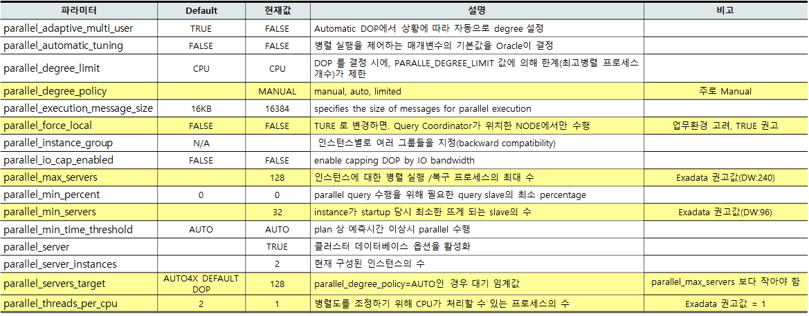

## 병렬처리  
### Exadata는 왜 Parallel 처리가 필요한가?
* Exadata의 가장 큰 장점중의 하나는 Smart scan을 하는 것임.
* ``Smart scan``은 Direct read가 필요한데 이를 하기 위해서는 ``parallel query``가 좋은 방법임.
* 병렬도(DOP)를 자동으로 하는 것보다 수동으로 관리하는 방법이 필요함
### Parallel Degree Policy
### 병렬 Query 및 병렬 DML 구현
* DoP(Degree of Parallelism) 갯수 선택
  * 테이블이나 인덱스 생성시 DoP 개수
  * parallel_threads_per_cpu * cpu_count * instance 개수로 계산됨 (2 * 16 * 2 = 64)
  * parallel_degree_limit=cpu
  * Hint
* Skew (병렬 프로세스의 스큐 처리)
  * SELECT DISTINCT은 매우 적은 값의 종류를 갖는 경우
  * Partition명 없이 Insert시 한 개의 Partition으로만 Insert하는 경우
* PQ Distribution
* 유형
  * Parallel Query
  * Parallel DML
  * Parallel DDL
* The Granules 
  * 병렬 처리 작업의 기본 단위를 Granule이라고 합
  * Block range granules(블록범위)
    * 실행시 동적으로 만들어짐
  * ``Partitions granules``(파티션)
    * 파티션 수에때라 정적으로 결정
    * 조건 : ``No. Of partition > parallel * _px_partition_scan_threshod `` 
      * threshod 기본값
        * _px_partition_scan_threshod=64
        * _px_partition_load_dist_threshod=64
* Producer Set -> Consumer Set 으로 Row DISTRIBUTION method
  * PARTITION : 행을 테이블 또는 인덱스의 분할을 기반으로 쿼리 서버에 매핑
  * HASH : 조인 키의 해시 함수를 사용하여 행을 쿼리 서버에 매핑
  * RANGE : 정렬 키 범위를 사용하여 행을 쿼리 서버에 매핑
  * ROUND-ROBIN : 행을 쿼리 서버에 무작위로 매핑
  * BROADCAST : 전체 테이블의 행을 각 쿼리 서버로 브로드 캐스트
  * QC (ORDER) : 실행 코디네이터는 입력을 순서대로 소비
  * QC (RANDOM) : 실행 코디네이터는 임의로 입력을 소비
* Parallel Partition Insert시 Skew 발생
  * Partition된 테이블에 Insert하는 경우, Select된 조건이 특정 Partition에만 들어간다는 것을 알 수 없기 때문에 하나의 Parallel process만 일하게 됨
   ```sql
   -- Partition KEY 값에 의해 분산되어 Serial하게 Insert됨
   INSERT /*+ APPEND PARALLEL(4) */ INTO GBA604S_T
   select /*+ FULL(a) PARALLEL(4) */ * from GBA604S a 
   where a.proc_ymd between :st_date and :ed_date;
   ```
     * 해결책
       * Insert시 파티션 지정 Partition
       ```sql
       INSERT /*+ APPEND PARALLEL(4)  */ INTO GBA604S_T PARTITION(R_201007)
       select /*+ FULL(a) PARALLEL(4) */ * from GBA604S a
       where a.proc_ymd between :st_date and :ed_date;
       ```
       * 받은 데이터를 분사하지 않거나 Random 하게 INSERT 
      ```sql
      --  PQ_DISTRIBUTE(T, NONE)  or PQ_DISTRIBUTE(T, RANDOM)
      INSERT /*+ APPEND PARALLEL(4) PQ_DISTRIBUTE(T, NONE) */ INTO GBA604S_T
      select /*+ FULL(a) PARALLEL(4) */ * from GBA604S a
      where a.proc_ymd between :st_date and :ed_date;
      ```
* Coordinator 위치 확인
  * ``Coordinator는 DML 명령문 위에`` 위치 해야 병렬 처리
* parallel query parameter
 
### SQL 실행계획
* dbms_sqltune.report_sql_monitor
  * dbms_sqltune.report_sql_monitor 패키지는 반환되는 타입이 CLOB이기 때문에, 볼 때는 옵션(SESSION)에서 LONG ```SIZE를 10000000``` 이상으로 키워 놓아야 충분한 정보를 볼 수 있음. (상용 툴에서도 마찬가지 임)
   ```sql
     SQL> SET LONG 10000000
     SQL> SET LONGCHUNKSIZE 100000000
     SQL> SET LINESIZE 1000
     SQL> SET PAGESIZE 0
     SQL> SET TRIM ON
     SQL> SET TRIMSPOOL ON
     SQL> SET SQLBLANKLINE ON
     --
     SQL> SQL> select dbms_sqltune.report_sql_monitor(SQL_ID=>'...', REPORT_LEVEL=>'ALL', TYPE=>'TEXT') report from dual;   
   ```

## Batch 처리
* 집합처리  Multi-table Insert 구문
  * Unconditional Insert All
```sql
INSERT ALL
INTO TAB_A values(empid, hdate, sal)
INTO TAB_B values(empid, hdate, sal)
INTO TAB_C values(empid, hdate, sal, managerid)
select empid, hiredate hdate, salary sal, managerid
from  emp
where empid > 1000;
```
   *  Conditional Insert All
```sql
INSERT ALL
WHEN sal >=3000 then INTO TAB_A values(empid, hdate, sal)
WHEN sal >=5000 then INTO TAB_B values(empid, hdate, sal)
select empid, hiredate hdate, salary sal, managerid
from emp
where empid > 1000;
```
   * Conditional Insert First 
```sql
INSERT FIRST
WHEN sal >=3000       then INTO TAB_A values(deptno,sal)
WHEN hdate like '%84' then INTO TAB_84 values(deptno,hdate)
WHEN hdate like '%85' then INTO TAB_85 values(deptno,hdate)
ELSE                                INTO TAB_99 values(deptno,hdate)
select deptno, sal, hdate 
from emp
where deptno = 10;
```
   * Pivoting Insert
```sql
INSERT ALL
INTO sales_info VALUES(empno, weekid, sales_mon)
INTO sales_info VALUES(empno, weekid, sales_tue)
INTO sales_info VALUES(empno, weekid, sales_wed)
INTO sales_info VALUES(empno, weekid, sales_thur)
INTO sales_info VALUES(empno, weekid, sales_fri)
select empno, weekid, sales_mon, sales_tue, sales_wed, sales_thur, sales_fri
from sales_source;
```
## 자동 통계정보관리
*  자동수행확인
```sql
SELECT CLIENT_NAME, JOB_SCHEDULER_STATUS
   FROM DBA_AUTOTASK_CLIENT_JOB  
   WHERE CLIENT_NAME =
   ‘auto optimizer stats collection’;
```
* 통계정보 관련 스크립트

```sql
--
/* Table 통계정보 수동 생성 */
exec dbms_stats.gather_table_stats(
     ownname => 'Schema_name', 
     tabname => 'Table_name', 
     estimate_percent => DBMS_STATS.AUTO_SAMPLE_SIZE,
     granularity =>'AUTO', --> default --> Incremental 방식의 경우 granuality가 ‘GLOBAL and PARTITION’으로 수행되며 Partition Type에 따라 결정됨.
     cascade => TRUE, --> index 생성시
     method_opt => 'FOR ALL COLUMNS SIZE AUTO', --> column histogram 통계(NDV, Cardinality)
     degree => 4);  -->  default is NULL

/* 일반적인 통계정보 생성 */
exec DBMS_STATS.GATHER_TABLE_STATS('sh','SALES', degree=>4);  --> 테이블레벨
exec DBMS_STATS.GATHER_SCHEMA_STATS('sh', degree=>4);  --> 스키마레벨

/* Table 통계정보 삭제 */
exec dbms_stats.DELETE_TABLE_STATS('Schema_name','Table_name','Partition_name');

/* num_rows = 0인 partition 통계정보 삭제시 대상 Script generation */
select 'execute dbms_stats.DELETE_TABLE_STATS(''DWADM'','''||TABLE_NAME||''','''||PARTITION_NAME||''');'
from  user_tab_partitions where num_rows = 0;

/* Table 통계정보 복사 */
exec dbms_stats.COPY_TABLE_STATS('Schema_name','Table_name','Source_Partition','Target_partition',1, NULL,FALSE);

/* Incremental 방식의 통계정보 생성 */
-- 1) Table Level :  
EXEC DBMS_STATS.SET_TABLE_PREFS('Schema_name','Table_name', 'INCREMENTAL', 'TRUE');
   2) Database Level :  
EXEC DBMS_STATS.SET_GLOBAL_PREFS('INCREMENTAL', 'TRUE');
```

```sql
/* 자동통계정보 중지하고자 할 경우 */
--> 통계정보 확인
col client_name for a40
select client_name, status from DBA_AUTOTASK_CLIENT where client_name='auto optimizer stats collection';

--> 자동통계정보 중지,
exec DBMS_AUTO_TASK_ADMIN.DISABLE(client_name => 'auto optimizer stats collection', operation => NULL, window_name => NULL);

/*통계정보 히스토리를 Table별로 확인하는 방법 */
SELECT *
FROM DBA_TAB_STATS_HISTORY
WHERE owner = 'DWADM' ORDER BY 1,2,3,4,5  DESC;

/* DML 변화량 확인 */
Select * from dba_tab_modifications where table_owner = 'DWADM';
--> Deletes, Updates, Inserts 컬럼의 합이 num_rows(dba_tables, dba_tab_partitions, dba_tab_statistics)의 10% 이상시 통계정보 대상
--> 통계정보 수행 후에는 해당 테이블 관련 레코드가 사라짐.

/* 통계정보 대상 확인 : 정기 통계 배치 작업 대상 Table or Partition */
Select * from dba_tab_statistics where owner = 'DWADM'  and (stale_stats = 'YES' or stale_stats is null)
order by nvl(to_char(last_analyzed,'yyyy-mm-dd hh24:mi:ss'),'1000-12-31 23:59:59') desc;
--> Stale_stats 컬럼이 ‘NULL’, ‘YES’로 표시된 테이블이 통계정보 대상이 됨.
--> Stale_stats 컬럼이 ‘NULL’인 경우는 테이블이 생성된 후 통계정보 수집이 한번도 안된 경우임.
```
