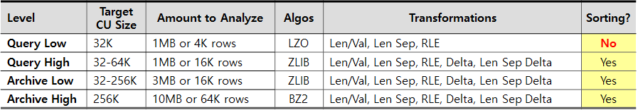
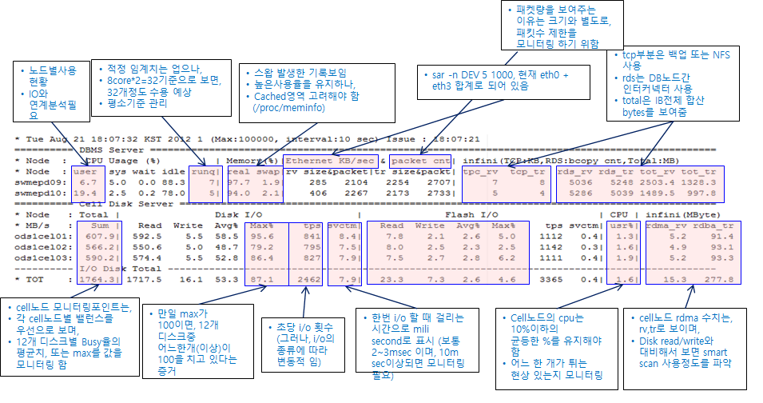

## Exadata Exadata Storage Software 
  
### Bundle Patch
```sql

  1* select patch_id,action_time,description from dba_registry_sqlpatch
SQL> /
  PATCH_ID ACTION_TIME                                                                 DESCRIPTION
---------- --------------------------------------------------------------------------- ------------------------------------------------------------------------------------------
  30805684 31-AUG-20 10.50.52.822540 AM                                                OJVM RELEASE UPDATE: 19.7.0.0.200414 (30805684)
  30869156 31-AUG-20 10.50.52.816766 AM                                                Database Release Update : 19.7.0.0.200414 (30869156)

2 rows selected.

```

* CRS 자원의 확인
```bash
<GRID_HOME>/bin/crsctl stat res -t
--------------------------------------------------------------------------------
NAME           TARGET  STATE        SERVER                   STATE_DETAILS       
--------------------------------------------------------------------------------
Cluster Resources
--------------------------------------------------------------------------------
ora.LISTENER_SCAN1.lsnr
      1        ONLINE  ONLINE       d02-0c                                       
ora.LISTENER_SCAN2.lsnr
      1        ONLINE  ONLINE       d02-0b                                       
ora.LISTENER_SCAN3.lsnr
      1        ONLINE  ONLINE       d02-0b                                       
ora.d02-0b.vip
      1        ONLINE  ONLINE       d02-0b                                       
ora.d02-0c.vip
      1        ONLINE  ONLINE       d02-0c                                       
ora.rac112.db
      1        ONLINE  ONLINE       d02-0b                                   
      2        ONLINE  ONLINE       d02-0c                                  
ora.scan1.vip
      1        ONLINE  ONLINE       d02-0c                                       
ora.scan2.vip
      1        ONLINE  ONLINE       d02-0b                                       
ora.scan3.vip
      1        ONLINE  ONLINE       d02-0b
```

```bash
$ <GRID_HOME>/bin/crsctl stat res -t
--------------------------------------------------------------------------------
NAME           TARGET  STATE        SERVER                   STATE_DETAILS       
--------------------------------------------------------------------------------
Local Resources
--------------------------------------------------------------------------------
ora.DATA.dg
               ONLINE  ONLINE       d02-0b                                       
               ONLINE  ONLINE       d02-0c                                       
ora.RECO.dg
               ONLINE  ONLINE       d02-0b                                       
               ONLINE  ONLINE       d02-0c                               
ora.LISTENER.lsnr
               ONLINE  ONLINE       d02-0b                                       
               ONLINE  ONLINE       d02-0c                            
ora.asm
               ONLINE  ONLINE       d02-0b                              
               ONLINE  ONLINE       d02-0c                             
ora.net1.network
               ONLINE  ONLINE       d02-0b                                       
               ONLINE  ONLINE       d02-0c                                                                              

```
### Smart Scan
* 스마트스캔 전제조건  
  *Full Scan, Direct Path Read, Object Stored on Exadata Storage 

* 스마트스캔 수행확인 – 대기이벤트 모니터링을 통한 확인
```sql
mon.sql
select to_char(sysdate, 'yy/mm/dd hh24:mi:ss') time,
       substrb(to_char(b.inst_id), -1) i,
       b.sid,
--     substrb(b.status, 1, 3) stat,
       substrb(b.event, 1, 32) "EVENT",
       substrb(b.username, 1, 8) "USER",
--     substrb(decode(instrb(b.program, '@'), 0, b.program, substrb(b.program, 1, instrb(b.program, '@') - 1)), 1, 16) program,
       substrb(decode(instrb(b.module, '@'), 0, b.module, substrb(b.module, 1, instrb(b.module, '@') - 1)), 1, 20) "MODULE",
       substrb((select object_name from dba_objects c where c.object_id = b.row_wait_obj# ),1,20) "OBJECT",
       decode(b.state, 'WAITING', b.seconds_in_wait, 0) waitsec,
       (sysdate - b.logon_time)*86400 duration,
       b.sql_id,
       b.client_info
  from gv$session b
 where 1=1
   and b.event not like '%SQL*Net%'
   and b.event not like 'DIAG idle wait%'
   and b.event not like 'PX Deq%'
   and b.event not like 'PX qref%'
   and b.event not like 'Space Manager%'
   and b.event not like 'Streams AQ%'
   and b.event not like '%message%'
   and b.event not like '%timer%'
   and b.event not like '%null event%'
   and b.event <> 'jobq slave wait'
   and b.event <> 'class slave wait'
   and b.event <> 'VKTM Logical Idle Wait'
   and b.event <> 'GCR sleep'
   and b.event <> 'PING'
   and b.event <> 'VKRM Idle'
   and b.event <> 'KSV master wait'
   and b.event not like 'EMON%'
   and b.type = 'USER'
--   and username='BMT'
--   and b.username not in ('SYS', 'SYSTEM', 'BACKUP2', 'DBSNMP')
--   and b.username in ('HDW1', HDW2')
--   and b.username is not null
--   and program not like 'Orange%'
--   and b.event not like '%SQL*Net%'
--order by "MODULE", b.inst_id, b.sid
order by b.client_info, b.inst_id, b.sid
;

```
* 스마트스캔 수행확인 – 다이나믹뷰(딕셔너리)를 통한 확인
  * v$sql
```sql
select sql_id,
       round(physical_read_bytes/1048576,1)                   phyrd_mb,
       round(io_cell_offload_eligible_bytes/1048576,1)         elig_mb,
       round(io_cell_offload_returned_bytes/1048576,1)       return_mb,       
       round(io_interconnect_bytes/1048576,1)               xchange_mb,
       decode(IO_CELL_OFFLOAD_ELIGIBLE_BYTES,0,'No','Yes') Offloaded,
       decode(IO_CELL_OFFLOAD_ELIGIBLE_BYTES,0,0,
              round((IO_CELL_OFFLOAD_ELIGIBLE_BYTES - IO_CELL_OFFLOAD_RETURNED_BYTES)
                        / IO_CELL_OFFLOAD_ELIGIBLE_BYTES*100,1)) as  "IO_SAVED_%"              
FROM     v$sql 
where 1=1
and   io_cell_offload_returned_bytes > 0
--and  parsing_schema_name = upper('SCOTT')
--and   sql_text LIKE '%from sales%';

```
  * V$SYSSTAT
```sql
select   b.name, a.value
from     v$mystat a, v$statname b
where  a.STATISTIC# = b.STATISTIC#
and     (b.name = 'cell session smart scan efficiency' or
            b.name = 'cell physical IO bytes saved by storage index' or
            b.name = 'cell physical IO bytes eligible for predicate offload' or
            b.name = 'cell physical IO interconnect bytes returned by smart scan‘ );

```
|V$SQL 컬럼|네용|
|---|---|
|IO_CELL_OFFLOAD_ELIGIBLE_BYTES|Exadata 스토리지 시스템에서 필터링 할 수 있는 I/O 바이트 수 / Offloading에 의해 절감될 것으로 예상되는 데이터양|
|IO_CELL_OFFLOAD_RETURNED_BYTES|Exadata 셀에서 반환 된 필터링 된 바이트 수 / 즉, Exadata 셀에서 처리가 오프로드 된 후 반환 된 바이트 수|
|IO_INTERCONNECT_BYTES|Oracle Database와 스토리지 시스템간 교환되는 I/O 바이트 수 / Storage Server에서 실제 반환된 데이터 양|
| PHYSICAL_READ_BYTES|모니터링되는 SQL이 디스크에서 읽은 바이트 수|

```sql
orcl_high> select n.name,s.value from v$mystat s, v$statname n where n.statistic#=s.statistic# and n.name like '%cell flash cache read%';
NAME                                                                    VALUE
------------------------------------------------------------ ----------------
cell flash cache read hits                                              17229
cell flash cache read hits for controlfile reads                            0
cell flash cache read hits for smart IO                                 17159
orcl_high> select n.name,s.value from v$mystat s, v$statname n where n.statistic#=s.statistic# and n.name like '%physical%optimized%';
NAME                                                                    VALUE
------------------------------------------------------------ ----------------
physical read requests optimized                                        17229
physical read total bytes optimized                               17963958272
...
orcl_high> select n.name,s.value from v$mystat s, v$statname n where n.statistic#=s.statistic# and n.name like '%smart scan%';
NAME                                                                    VALUE
------------------------------------------------------------ ----------------
cell physical IO interconnect bytes returned by smart scan           18662816
...
```
* Cell Disk Usable size 및 Mirroring 
```sql
select  name,
total_mb Total_r,
free_mb free_r,
required_mirror_free_mb req_fee_r,
case name when 'DATA_KRX2A' then  (total_mb-required_mirror_free_mb)/3
else (total_mb-required_mirror_free_mb)/2  end recom_use,
USABLE_FILE_MB  recom_free,
case name when 'DATA_KRX2A' then  total_mb/3
else total_mb/2  end tot_use,
case name when 'DATA_KRX2A' then  free_mb/3
else free_mb/2  end free_use,
case name when 'DATA_KRX2A' then  ((total_mb-free_mb)/3)
else ((total_mb-free_mb)/2) end used
from    v$asm_diskgroup
/

```
* SMART SCAN여부 점검
```sql
set pagesize 999
set lines 190
col sql_text format a70 trunc
col child format 99999
col execs format 9,999
col avg_etime format 99,999.99
col "IO_SAVED_%" format 999.99
col avg_px format 999
col offload for a7

select sql_id, child_number child, plan_hash_value plan_hash, executions execs,
(elapsed_time/1000000)/decode(nvl(executions,0),0,1,executions)/
decode(px_servers_executions,0,1,px_servers_executions/decode(nvl(executions,0),0,1,executions)) avg_etime,
px_servers_executions/decode(nvl(executions,0),0,1,executions) avg_px,
decode(IO_CELL_OFFLOAD_ELIGIBLE_BYTES,0,'No','Yes') Offload,
decode(IO_CELL_OFFLOAD_ELIGIBLE_BYTES,0,0,100*(IO_CELL_OFFLOAD_ELIGIBLE_BYTES-IO_INTERCONNECT_BYTES)
/decode(IO_CELL_OFFLOAD_ELIGIBLE_BYTES,0,1,IO_CELL_OFFLOAD_ELIGIBLE_BYTES)) "IO_SAVED_%",
sql_text
from v$sql s
where upper(sql_text) like upper(nvl('&sql_text',sql_text))
and sql_text not like 'BEGIN :sql_text := %'
and sql_text not like '%IO_CELL_OFFLOAD_ELIGIBLE_BYTES%'
and sql_id like nvl('&sql_id',sql_id)
order by 1, 2, 3
/
```

```sql
SQL> alter session set cell_offload_processing=true;
SQL> select /*+ parallel(s_on, 2) */ count(*) from sales where amount_sold >= 1500;

SQL> alter session set cell_offload_processing=false;
SQL> select /*+ parallel(s_off, 2) */ count(*) from sales where amount_sold >= 1500;
SQL> select substr(SQL_TEXT, 20, 10) SQL_TEXT, IO_INTERCONNECT_BYTES, PHYSICAL_READ_BYTES,
round(IO_INTERCONNECT_BYTES/PHYSICAL_READ_BYTES*100, 2) "TRANS(%)"
from v$sql where sql_text like 'select /*+ parallel(s_%';

```
|SQL_TEXT |  IO_INTERCONNECT_BYTES |PHYSICAL_READ_BYTES|  TRANS(%)|
|---|----:|----:|----:|
|Smart ON|230976|13262848|1.74|
|Smart OFF|13262848|13262848|100.00|


* Hint
  * cell_offload_plan_display : (auto | always | never)
    * always : Non-Exadata 환경에서 Exadata Assessment를 위해 활용 가능
    * never  : Exadata 환경에서 Non-Exadata 환경의 (original) 실행 계획과의  비교를 위해 활용 가능
  * _Storage Index disabling: _kcfis_storageidx_disabled = false | true

* Wait Event
  * cell smart table scan
  * cell smart index scan
  * cell single block physical read
  * cell list of blocks physical read
  * cell multiblock physical read

* Smart Scan 제어를 위한 기본 방법
  * CELL_OFFLOAD_PROCESSING = TRUE | FALSE
    * alter system / alter session / opt_param 힌트

  * ASM Disk Group 속성 cell.smart_scan_capable = true | false
    * alter diskgroup … set attribute
### Storage Index
* 사용확인
```sql
select   b.name, a.value
from     v$mystat a, v$statname b
where  a.STATISTIC# = b.STATISTIC#
and     (b.name = 'cell session smart scan efficiency' or
            b.name = 'cell physical IO bytes saved by storage index' or
            b.name = 'cell physical IO bytes eligible for predicate offload' or
            b.name = 'cell physical IO interconnect bytes returned by smart scan' );

```
* 스토리지 인덱스의 제어
```sql
SQL> ALTER SESSION SET "_kcfis_storageidx_disabled" = TRUE;
```
* 자주 사용되는 조건의 컬럼에 대해 sorting을 하여 Insert를 해 놓으면, 스토리지 인덱스의 효용성을 높일 수 있음.

### EHCC
* 공간절약 및 Disk I/O를 최대한 줄이기 위해 Logical Compression Unit 단위로 행을 묶는 컬럼압축방식을 사용.
* 
* EHCC를 통한 공간 절감 예측 방법
```sql
dbms_compression.get_compression_ratio(
    scratchtbsname => '&&tbs',
    ownname => '&&owner’,
    tabname => '&&tab’,
    partname => null,
    comptype => dbms_compression.comp_for_query_low,
    blkcnt_cmp => l_blkcnt_cmp,
    blkcnt_uncmp => l_blkcnt_uncmp,
    row_cmp => l_row_cmp,			
    row_uncmp => l_row_uncmp,
    cmp_ratio => l_cmp_ratio,		
    comptype_str => l_comptype_str
);
```
* 압축 여부 확인 방법
```sql
Select dbms_compression.get_compression_type(‘&OWNER',‘&TAB‘, rowid) 
from &TAB;
```
* EHCC 압축은 Direct Path Insert / Loading에 의해서만 수행
  * Decompression은 어디에서 일어나는가
    * Smart Scan이 수행된다면 Cell에서 : 
      * _cell_offload_hybridcolumnar = ``true`` | false
      * cell IO uncompressed bytes > 0 (v$sysstat)

    * Smart Scan이 수행되지 않는다면 DB 서버에서
      * 전체 CU가 압축된 상태에서 버퍼 캐시로 전송됨
      * cell IO uncompressed bytes > 0 (v$sysstat)
* Query Mode
```sql
CREATE TABLE … COMPRESS FOR QUERY LOW
CREATE TABLE … COMPRESS FOR QUERY HIGH
CREATE TABLE … COMPRESS FOR ARCHIVE LOW
CREATE TABLE … COMPRESS FOR ARCHIVE HIGH
```
* COmpression 변경 방법
  * 테이블 전체의 정의만 변경하는 경우
```sql
    alter table ORDERS compress for query high;
```  
  * 테이블 전체의 정의와 데이터까지 변경하는 경우
```sql
     alter table ORDERS move compress for query high parallel 32;
```  
### Smart Flash Cache
* 네가지 활용 방법
  * Smart Flash Cache
  * Smart Flash Logging
  * Smart Write-Back Cache
  * Exadata Flash Cache 압축 
* 압축 명령어
```sql
   alter cell flashCompression=TRUE
```
* Cache 현황의 확인 방법
```sql
CellCLI> list flashcachecontent
…
    cachedKeepSize:    	 0
    cachedSize:        	 598016
    dbID:              	 2825298339
    dbUniqueName:      	 KRX3BA
    hitCount:          	 0
    missCount:         	 291
    objectNumber:      	 4294967294  -- dba_ojbects.data_object_id
    tableSpaceNumber:  	 1

CellCLI>

```
  * CELL_FLASH_CACHE = KEEP
* 성능 효과 확인 방법
  * “physical read total bytes optimized / physical read total bytes”

### IORM 
* Exadata 위에 단일 데이터베이스 : 
  * Intradatabase: by Consumer Group
  * DB 단 설정 (DBMS_RESOURCE_MANAGER)
* 복수의 데이터베이스들을 운영   : 
  * Interdatabase: by Database : Cell 단 설정 (IORMPLAN)
  * Category: by Category
    * Category by Consumer Group
* IORM objective 설정
  * basic | low_latency | high_throughput | balanced | auto
* IORM 모니터링 방법
  * Tool for Gathering I/O Resource Manager Metrics: metric_iorm.pl [ID 1337265.1]
* IORM의 자원 분배 알고리즘
  * ① catPlan
  * ② dbPlan
  * ③ DBRM Plan
  * 최종 할당
###  기타 성능 관련 Topic들
* DOP의 수동 지정
  * Default DOP = parallel_threads_per_cpu x cpu_count x instance_count
  * alter session force parallel query | dml | ddl parallel N;
  * parallel 힌트
  * Database Resource Manager
* Inter-Node Parallelism
  * Local DB 서버만을 사용  parallel_force_local = true | false
* 병렬 DML 관련 고려 사항
  * 세션에 병렬 DML 모드를 설정해야 함
    * alter session enable parallel dml;
  * SQL 변환
    * Direct Path, Nologging 방식의 Insert가 최상의 성능 
* 병렬 처리의 모니터링 :     Real-Time SQL Monitoring vs v$pq_tqstat
* Partition Granule 사용 시 DOP는 Partition 개수로 제한
* 병렬 조인과 데이터 재분배
  * Parallel Join
  * PQ_DISTRIBUTE 힌트
* Exadata 시스템 통계
  * execute dbms_stats.gather_system_stats('EXADATA');
  * execute DBMS_STATS.GATHER_FIXED_OBJECTS_STATS;    -- X$...
* ``HugePage 설정``
  * HugePage 설정의 필요성
    * HugePage는 swap되지 않음
    * Page Table 사이즈 축소
    * TLB(Translation Lookaside Buffer) Hit 증가, Page Walk 감소
  * 설정 방법
    * Shell Script to Calculate Values Recommended Linux HugePages / HugeTLB Configuration ``[ID 401749.1]``
    *  USE_LARGE_PAGES = TRUE | ONLY | FALSE | AUTO
### Automatic Storage Management
* ASM 데이터 보호 수준
  * Normal Redundancy: 2 개의 Cell에 걸쳐 “Double Mirroring” : 1 개 Cell의 장애까지 커버
  * High Redundancy: 3 개의 Cell에 걸쳐 “Triple Mirroring”   : 2 개 Cell의 장애까지 커버
* Rebalancing Power
  * ``alter diskgroup data_dg rebalance power 16;``
  * 0 ~ asm_power_limit (최대 값 1,024) / Default 4
  * 모니터링 : ``V$ASM_OPERATION``
* Fast Mirror Resync
  * ``alter diskgroup data_dg set attribute 'disk_repair_time'='7.2h‘;`` 
  * ASM은 offline 상태가 된 디스크를 영구히 drop하기 전에 disk_repair_time으로 명시된 시간 동안 대기
    * ASM이 자동으로 Rebalance를 수행하기 전까지의 대기 시간을 의미
  * 문제의 디스크가 다시 Online 상태가 되면 ASM은 오직 변경이 가해진 Extent에 대해서만 Rebalance를 수행
    * 따라서 두 번째 Rebalance 작업을 훨씬 더 빠르게 마칠 수 있도록 함
  * Default 3.6 시간
### Backup & Recovery
* Base Tool은 RMAN
  * ASM 환경에서 유일한 방안
* Output 파일 공간 할당량 조절
  * _file_size_increase_increment=2143289344
* Exadata 백업 권고 사항
  * RMAN Recovery Catalog 이용
    * Repository DB는 별도의 서버에 구성
  * Backup 용 데이터베이스 서비스 이용
  * 운영 영향도 최소화
    * DBRM / IORM을 이용 
    * ADG를 이용하여 Standby DB에 백업 작업을 Offload

### Exadata 모니터링 / 진단 / 유지 보수 관련 Tool

* OSWatcher Black Box (Includes: [Video]) [ID 301137.1]
  * OS 레벨의 모니터링 도구
    *vmstat, netstat, iostat, etc.
  *두 가지 구성 요소
    * oswbb: 데이터 수집 & 저장을 위한 shell scripts
    * oswbba: Graphical한 분석을 위한 java utility

* sar.sh
  * sar 등의 OS 명령
  * CellCli list metriccurrent
  * Oracle Wait Interface 조회
  * 
* Exachk.sh
  * Exadata 진단 및 Health Check을 위한 Tool
  * Oracle Exadata Database Machine exachk or HealthCheck [ID 1070954.1]
```bash
  $ ./exachk : 1회 수행
$ ./exachk -m : MAA Scorecard 점검을 skip
$ ./exachk -d : 데몬 형태로 주기적으로 자동 수행  (추가 설명)
$ ./exachk -diff  : 결과 비교 (추가 설명) 
$ ./exachk -u : pre-upgrade 또는 post-upgrade best practices 점검 (11.2.0.3,11.2.0.4.0 및 12.1.0.1)  -o pre 또는 -o post 필수  (예 ./exachk -u -o pre )
$ ./exachk -v : version 확인

$ ./exachk -profile : Pass specific profile (예 : ./exachk -profile dba)
asm             asm Checks
clusterware     clusterware checks
dba             dba Checks
goldengate      oracle goldengate checks
maa             Maximum Availability Architecture Checks
storage         Storage Server Checks
switch          Infiniband switch checks
sysadmin        sysadmin checks
```
```sql
$ ./exachk -d start 
    exachk 수행과 동일하게 물어봄
$ ./exachk -d status,   상태확인 
   Daemon is running. PID : 62661
$ ./exachk -d nextautorun  
   AUTORUN_SCHEDULE = 12,13 * * *
$ ./exachk -d stop    중지

설정변경
$ ./exachk -set "AUTORUN_SCHEDULE= 12,13 * * *“
$ ./exachk -set NOTIFICATION_EMAIL=nobody@oracle.com

AUTORUN_SCHEDULE      * * * *       :- Automatic run at specific time in daemon mode.                               ¦ ¦ ¦ ¦                               ¦ ¦ ¦ +----- day of week (0 - 6) (0 to 6 are Sunday to Saturday)                               ¦ ¦ +---------- month (1 – 12)                               ¦ +--------------- day of month (1 – 31)                               +-------------------- hour (0 - 23)

```
* Exa_Health_Check
  * 간소화된 Health Check
* ADR (arcli)
  * Trace, Dump, Log 등 “진단 데이터”를 위한 파일 기반 통합 Repository
  * Exadata DB 서버 및 Cell 서버 모두
```sql
adrci> show alert

Choose the alert log from the following homes to view:

1: diag/clients/user_oracle/host_3824420761_80
2: diag/tnslsnr/krx3b01/krx3b-scan
3: diag/tnslsnr/krx3b01/listener_scan1
4: diag/tnslsnr/krx3b01/listener
5: diag/asm/+asm/+ASM1
6: diag/asm/user_oracle/host_3824420761_80
7: diag/diagtool/user_oracle/host_3824420761_11
8: diag/rdbms/krx3ba/krx3ba1
9: diag/rdbms/add1/ADD11
10: diag/asmtool/user_oracle/host_3824420761_80
Q: to quit

Please select option: 8
Output the results to file: /tmp/alert_6617_13992_krx3ba1_1.ado

2013-04-09 17:17:01.197000 +09:00
Starting ORACLE instance (normal)
****************** Large Pages Information *****************

Total Shared Global Region in Large Pages = 16 GB (100%)

Large Pages used by this instance: 8193 (16 GB)
…


$ ./exachk -diff exachk_krx2adb01_KRX2A_091213_160501 exachk_krx2adb01_RMANC_091713_141945

```
* DiagTools
  * Exadata Storage Server Diagnostic Collection Guide [ID 735323.1]
  * DbmCheck.sh : Cell 관련 구성 정보
  * diagget.sh  : DB 서버 관련 구성 정보, 각종 Oracle S/W 로그
* OPLAN
  * Oracle Software Patching with OPLAN [ID 1306814.1]
  * Patch 작업을 도와 주는 Tool
    * Patch Apply 및 Rollback에 대한 step-by-step 가이드 제공

### MOS Note
* Exadata Storage Server Diagnostic Collection Guide (Doc ID 735323.1)
* Where / How to find OS crashcore file in Exadata Systems [Linux] (Doc ID 1389225.1)
* How to get the stack trace of kdump in Exadata (Doc ID 1363245.1)
* How to Configure "kdump" on Oracle Linux 5 (Doc ID 452067.1)
* Location of Different Logfiles in Exadata Environment (Doc ID 1326382.1)
* Information Center: Troubleshooting Oracle Exadata Database Machine [Article ID 1346612.2]

